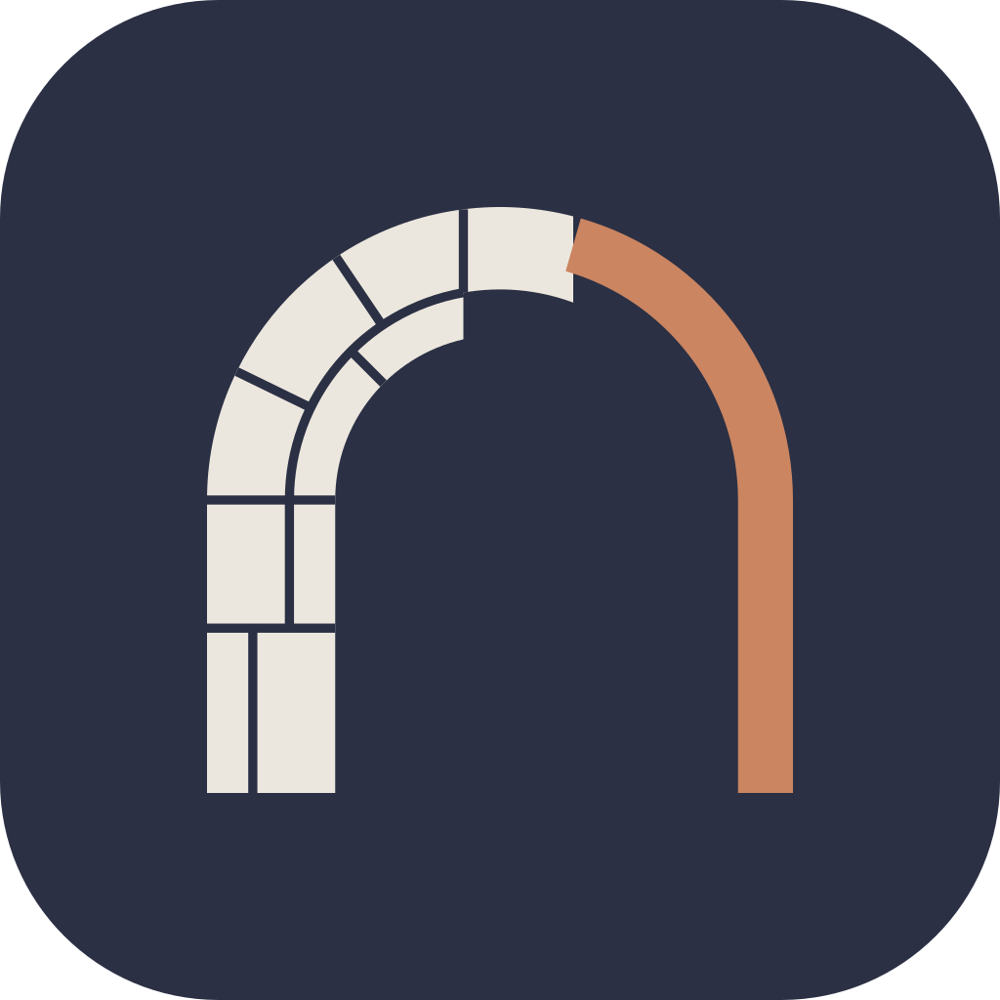
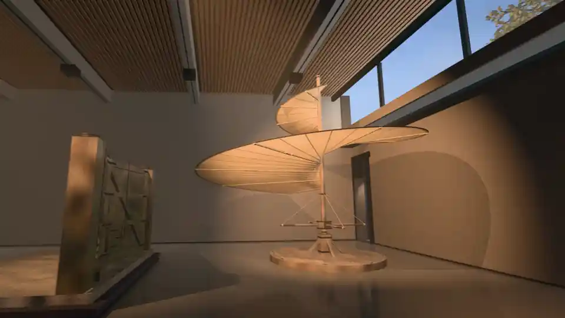
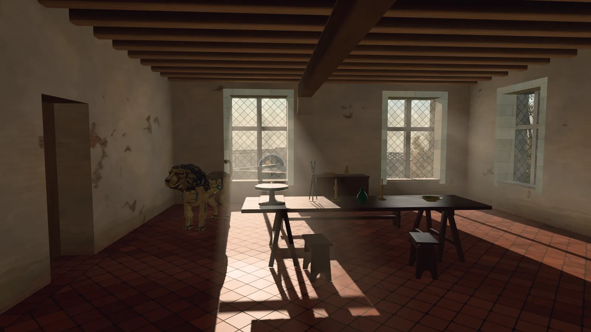
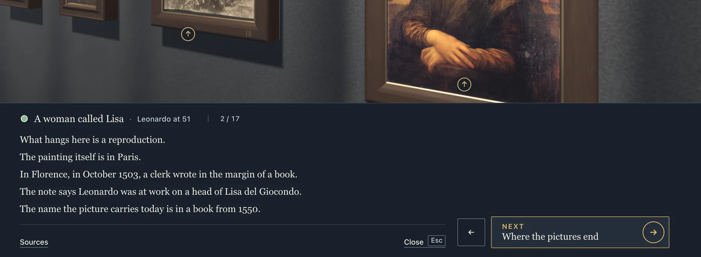
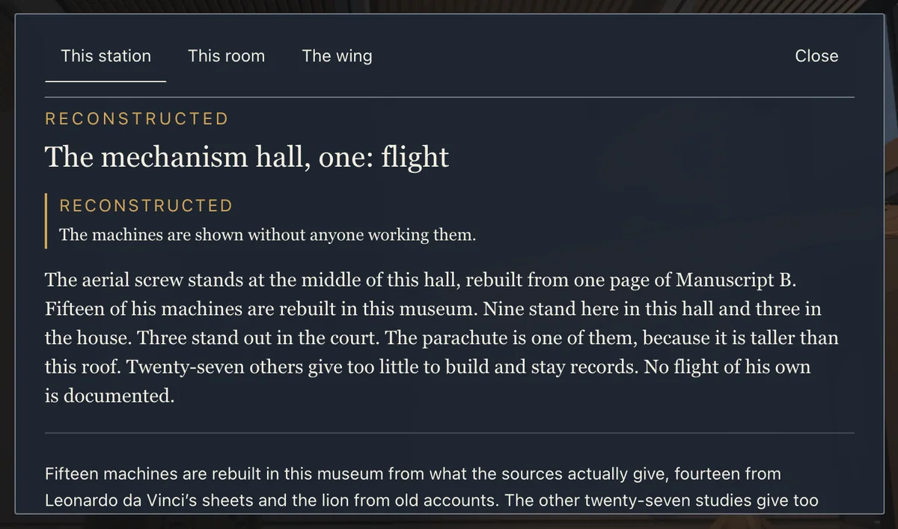
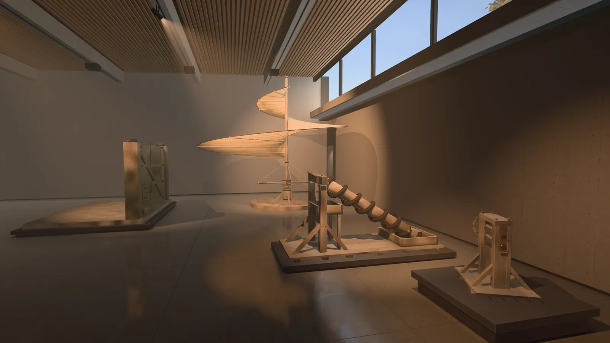

<p align="center">
  <a href="https://museumofages.org"></a>
</p>

<h1 align="center">Museum of Ages</h1>

<p align="center">a digital museum</p>

<p align="center">
  <strong>We rebuild what was. You walk through it.</strong><br/>
  <sub>Nonprofit · Open Source · No tracking cookies, no profiling</sub>
</p>

<p align="center">
  <a href="https://github.com/chipmates/museumofages/actions/workflows/ci.yml"></a>
  <a href="LICENSE"></a>
  <a href="CONTENT-LICENSE.md"></a>
  <a href="#how-it-is-built"></a>
</p>

<p align="center">
  <a href="https://museumofages.org/w/vinci?film=job&amp;lang=en">Enter the museum</a> ·
  <a href="https://museumofages.org">museumofages.org</a> ·
  <a href="docs/TOUR.md">Tour</a> ·
  <a href="#run-it-locally">Run it locally</a> ·
  <a href="#how-sure-a-statement-is">How sure a statement is</a> ·
  <a href="#how-you-can-take-part">Take part</a>
</p>

Museum of Ages has one wing today: Leonardo da Vinci's last house, Clos Lucé in Amboise, on 10 October 1517, rebuilt in code. You move through it as a film, stop by stop, 17 stops in all. At most of them you can step up to the work in front of you, and the machines in the mechanism hall can be set in motion. Each stop tells you how sure we are of what it says.

<p align="center">
  <a href="https://museumofages.org/w/vinci?film=job&amp;lang=en"><picture>
    <source media="(prefers-reduced-motion: reduce)" srcset=".github/assets/demo-poster.webp" />
    
  </picture></a><br/>
  <sub>From the door to the stars, in 33 seconds. The museum itself is slower: a stop holds until you go on.</sub><br/>
  <sub><a href="https://museumofages.org">museumofages.org</a>: free entry, no account. English and German, and five more languages translated with AI. <a href="docs/TOUR.md">A tour in pictures</a> credits every work you see.</sub>
</p>

This repository holds the museum itself in `museum/` and the code of its website in `site/`. The code, the texts in every language and the records of everything the museum builds are here, open to read and to check. [How you can take part](#how-you-can-take-part) says where to start.

## What you see

The wing shows Clos Lucé on one day of Leonardo's life. The day is documented. On 10 October 1517 a cardinal visited this house, and his secretary wrote down three paintings, a paralysis in the right hand, and that Leonardo still drew and taught. The hour inside that day is the museum's choice, 15:19 by the sun, and the light is computed from that date and that place.

Before the house come the rooms the museum designed for his work. A picture room where 24 works hang close to their real size, the Mona Lisa among them. One is a copy by other hands, because his own is lost, and the last is from his workshop and not his own hand. A hall of machines. A long gallery with a reading table and a wall of his anatomy sheets, the dates of his life cut into its floor. A court that carries the Last Supper at the size of the original in Milan. Then the house itself, where you enter one room, the great hall. The last stop is a court under the stars of that evening.

Fifteen machines are rebuilt from what the sources give, fourteen from his sheets and the lion from old accounts.

<p align="center">
  <br/>
  <sub>The great hall of Clos Lucé, rebuilt from plans and photographs. The lion by the wall is built after old accounts. No sheet of it is known.</sub>
</p>

Museum of Ages is a website, built once for the phone and once for the desktop, in English and German, and translated with AI into French, Italian, Spanish, Brazilian Portuguese and Bulgarian. Each translation says so until a person has read it. Free entry, no account. It draws with WebGPU and falls back to WebGL2. A browser with neither gets one plain page that says so, with a link to the wing's page on the site. There are no spoken words yet, and the wing hasn't been tested with a screen reader.

<p align="center">
  
  <br/>
  <sub>On a phone: a stop in the mechanism hall, and the Mona Lisa's close look.</sub>
</p>

## What is inside

- **The walk.** 17 stops that tell one story, past about 75 works you can step up to.
- **The picture room.** 24 works hung close to their real size, 22 paintings and 2 drawings. Each label says how sure the attribution is: 14 documented, 4 disputed, 4 qualified, 1 from his workshop and 1 a copy of a lost work.
- **The Last Supper.** On a court wall at the size of the original in Milan, 8.8 m by 4.6 m.
- **The machines.** 15 rebuilt, and 14 of them move. Nine stand in the mechanism hall, three in the court and three in the house.
- **The anatomy wall.** 29 of his anatomy sheets.
- **The reading table.** A printed edition of 1883 of two of his notebooks, 438 pages to turn. 17 topics gather 207 pages from his notebooks. A shelf holds seven more books of his notes, 1,158 sides in all.
- **The heart.** A film of about 30 seconds shows the flow behind a heart valve in the museum's own glass model, built from his notes.
- **His life in dates.** Twelve dates of his life are cut into the gallery's floor.
- **The house.** The great hall of Clos Lucé, rebuilt from plans and photographs.
- **The sky.** The stars as they stood over Clos Lucé at nine in the evening of 10 October 1517, worked out star by star from a star catalogue.

The works shown come from 22 collections, each named on its label.

## How sure a statement is

"As it was, as far as we know." Every stop carries one of four grades. A mark before the stop's title shows which, each grade in its own shape and colour, and the stop's record names it in words. The [statement page](https://museumofages.org/what-this-museum-is/) uses the same four:

| Grade | Mark | What it means |
|---|---|---|
| Documented | Full disc | A source from the time says it, and we name the source. |
| Reconstructed | Half disc | No source says it outright. We worked it out from what the sources give. |
| Conjectural | Open ring | We think so, or a scholar does, and no source says it. Take it as a reasoned guess. |
| Not known | Broken ring | Nobody knows. We say that too, and we leave the gap open. |

Words like disputed or workshop in the list of paintings are something else. They say who is thought to have made a work.

A stop has three layers of text: the line you read first, a drawer that opens when you want more, and the record, which names the sources. The Mona Lisa's stop is graded documented, and its drawer says that in October 1503 a clerk in Florence wrote in the margin of a book that Leonardo was at work on a head of Lisa del Giocondo. At the aerial screw the record says: "Reconstructed from Ms B f. 83v. No lifetime flight is documented."

<p align="center">
  <br/>
  <sub>The drawer at the Mona Lisa's stop, open under the painting.</sub>
</p>

<p align="center">
  <br/>
  <sub>The record at the first stop of the mechanism hall. Its grade is reconstructed.</sub>
</p>

The labels also say what is ours. The furniture in the great hall isn't his own. A house like this had such things at the time. The court with the Last Supper is the museum's design, not a place from his life. The diary of 1517 names no room, so the rooms are our choice: the wing receives the cardinal in the great hall and puts what his secretary saw behind the study's window. The stars at the last stop are worked out star by star from a catalogue, for the day the diary gives and an hour we chose. The sunset is a usual October evening, and the shooting star is the museum's own.

## How it was made

The museum's statement page says how the words are made: "A person reads, corrects and approves every English and German text before it is published. The drafts are written with AI from a research file that names a source for every fact. The other languages are translated with AI, and each says so until a person has read it." Those research files aren't public yet, though some records here point to them. Each stop's record in the museum names its sources. The code was written with AI help as well. Each machine's record in `museum/assets/wing-vinci/manifest.json` names the model that wrote its code.

No picture in the wing comes from an image model. The rooms and machines are built in code and filmed in the museum's own engine, and the textures are CC0 photo scans. A few props are CC0 models from an open library, a cask and a basket among them. The paintings, drawings and notebook pages are reproductions: digital copies of public domain works, each labelled with its holder and its licence line.

<p align="center">
  <br/>
  <sub>The mechanism hall, a still from the museum's film. The hall is the museum's own design. The machines are built in code after his sheets.</sub>
</p>

## How it is built

The museum is TypeScript on three.js, bundled with Vite. It draws with WebGPU, and where a browser has no WebGPU adapter the same node graph runs on WebGL2. That's why every material is written in TSL. The film is this code, recorded: the tools in `museum/forge/film/` run the live wing in a browser and render it clip by clip.

The camera that films it never moves on an unproved line. When the wing starts, it hashes its collision meshes and refuses to route the camera unless that hash is certified. `rail-certify.mjs` makes the certificate by proving each route clear of the real triangles.

In the film only one thing is drawn live: a machine in its close look. Where the device can't hold 30 frames a second, and on every phone for now, the machine plays as a filmed cycle instead. A painting's close view is a tile pyramid in OpenSeadragon, so you can zoom into the reproduction.

Every reproduction and every built thing has a record, and every record carries a licence line. The records of built things live in this repository under `museum/assets/`. The art and the records of the reproductions live in an asset store outside git, and the build writes every record into one file, `na-manifest.json`, which museumofages.org serves with the art. `pnpm build` runs `forge/manifest-check.mjs` first, which stops the build when something the museum shows has no record or when a file doesn't match its hash.

The website is static HTML, built from `site/_src/` by a Python script that uses only the standard library.

## Run it locally

You need Node.js 22.12 or newer and pnpm 8.15.5, which `museum/package.json` pins. If you have no pnpm yet, `npm install -g pnpm@8.15.5` gets it.

```bash
git clone https://github.com/chipmates/museumofages.git
cd museumofages/museum
pnpm install
pnpm dev
```

Then open [localhost:5199/w/vinci?film=job&lang=en](http://localhost:5199/w/vinci?film=job&lang=en). Put `lang=de` in the address for German.

The museum's art is not in git. With no local store, the dev server reads what the wing shows from museumofages.org, the record of every file included, and its first lines in the terminal say so. The film alone is about 110 MB this way.

`pnpm typecheck` runs on any clone, and so does `node forge/manifest-check.mjs --records-only`, which checks every record the repository carries. `pnpm build` checks every file it ships against its record, so it needs the museum's own store. Without one it stops with a message that says so.

Leave out `film=job` and the same address runs the live engine the film is rendered from. Without a local store it reads about 220 MB of textures and models from museumofages.org before the first stop. `tier=calm`, `tier=standard` or `tier=hero` in the address sets its detail.

### The website

Python 3.9 or newer, standard library only. From the repository's root:

```bash
python3 site/_src/tools/fetch.py          # once: 294 pictures and media files, 8.4 MB, every hash checked
python3 site/_src/build.py                # the pages, into site/dist/
python3 -m http.server -d site/dist 8000  # look at them on localhost:8000
```

The fetch tool takes the files from the live site one at a time and keeps a file only when its hash matches. The pages link "Enter the museum" to `/w/vinci`, which this static server doesn't have. That address belongs to the dev server above.

### If something is missing

| What you see | What to do |
|---|---|
| pnpm or Vite refuses your Node version | Install Node.js 22.12 or newer. |
| The wing opens without pictures | Read the dev server's first lines, they say where it looks. Check that museumofages.org is reachable. |
| A 404 for one file in the browser console | Look at its record. A file marked `display: false` is never public, so that 404 is expected. |
| `pnpm build` stops at the manifest check | It needs the museum's own store. `node forge/manifest-check.mjs --records-only` checks what a clone can check. |
| Your browser has no WebGPU | Nothing to do. The same scenes run on WebGL2. |
| Your browser has neither WebGPU nor WebGL2 | The wing needs one of them. Turn on hardware acceleration, or try another browser. |
| The site's build stops and names `fetch.py` | Run `python3 site/_src/tools/fetch.py` first. |

[CONTRIBUTING.md](CONTRIBUTING.md) has the film's tests and the rest of the setup.

## How you can take part

You don't need to write code to help. Here is what you can do today:

- **Correct what it says.** If a date, a credit or a sentence is wrong, open a correction in the [issue picker](https://github.com/chipmates/museumofages/issues/new/choose) and name your source. We check it, then change the sentence in English and German. It's the quickest way to change what the museum says.
- **Report what breaks.** The bug report in the same picker, with your device and browser. Reports from phones, older laptops and browsers without WebGPU help most.
- **Try it with a screen reader.** The wing hasn't been tested with one yet. If you use a screen reader, tell us how far you get and where it stops making sense.
- **Improve the code.** A machine's motion, the engine on a phone, the path without WebGPU, the site's pages. [CONTRIBUTING.md](CONTRIBUTING.md) has the setup, the checks and the bar a reconstruction has to meet. A displayed sentence always lands in English and German under the same key.
- **Propose a picture.** Open an issue with the work, its holder, the page where the file is offered and its licence line word for word. We fetch it ourselves if the licence and the route allow it. A new picture never goes into this repository.
- **Propose a wing.** The da Vinci wing tells one life in the place where it ended. If there's another life and place you'd like to see, open "A wing you'd like to see" in the same picker: who, where, which day, the sources that tell it, and where open copies of the works could come from. A wing is a lot of work, from the research to the film, and building one together with people from outside is new for us. So it starts with that conversation.
- **Read a translation.** French, Italian, Spanish, Brazilian Portuguese and Bulgarian are machine translations today, and each says so. If one of them is your language, read a part of it against the English or the German and tell us what is wrong. A person's read is what takes the label off. Open an issue to start, and for another language as well.

If your institution holds a work shown here, write to [contact@museumofages.org](mailto:contact@museumofages.org). A security problem goes to the same address, quietly first, as [SECURITY.md](SECURITY.md) says.

## Who runs it

Museum of Ages is a project of ChipMates gemeinnützige GmbH, a small German nonprofit in Freiburg. Its purpose is education. ChipMates pays for the museum. The site carries no advertising and sells nothing. The museum has no partnership with any museum, and ChipMates alone decides what it shows and says. A label names a holder because it keeps the original, and for no other reason. The [privacy page](https://museumofages.org/privacy/) lists the few notes the wing keeps in your browser, and they stay on your device. ChipMates' other project is [Agora Cosmica](https://github.com/chipmates/agoracosmica).

## Rights and licences

| What | Terms |
|---|---|
| The code in this repository | [AGPL-3.0](LICENSE) or any later version |
| The texts and pictures the museum makes itself | [CC BY-SA 4.0](https://creativecommons.org/licenses/by-sa/4.0/), © ChipMates gemeinnützige GmbH and contributors |
| Each reproduction | Its own licence line, on its label and in its record |
| The map and relief data the house is built from | ODbL 1.0, © OpenStreetMap contributors, and Licence Ouverte 2.0 from IGN |
| Everything else the museum and its site take from others | As listed in [THIRD-PARTY.md](THIRD-PARTY.md) |

The originals stay with their holders. Several kinds of licence and rights note are in the wing today, among them CC0 and, for the scans of the Bibliothèque de l'Institut de France, CC BY-NC-ND 3.0 FR. Where a holder claims rights in the image of a public domain work, the label says so. A file under a licence that allows no changes is shown whole, byte for byte. No page or view that shows a file under a non-commercial licence asks for donations or carries advertising. The CC BY-SA covers the museum's own texts and the stills and films it renders. It does not cover what others made inside them, such as reproductions, music, quotations and map data, nor the museum's name and logo. [CONTENT-LICENSE.md](CONTENT-LICENSE.md) has the full note and shows how to credit a still.

We are glad when a walk here ends in front of the real thing: in Amboise, in a museum, in the reading room of a library. Questions and corrections go to [contact@museumofages.org](mailto:contact@museumofages.org).
