# A tour of Museum of Ages

Eleven pictures of the da Vinci wing as it stands on [museumofages.org](https://museumofages.org) in October 2026. They were taken in the museum itself, on a desktop and on a phone, in English and once in German. The works you see in them are listed with their credits [at the end](#credits).

## The door

  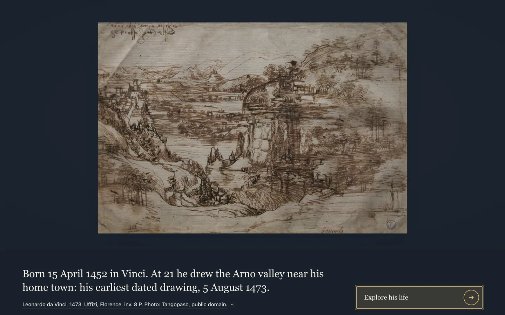 
  <em>The wing opens on his earliest dated drawing, one line about it, and one way in.</em>

## The picture room

  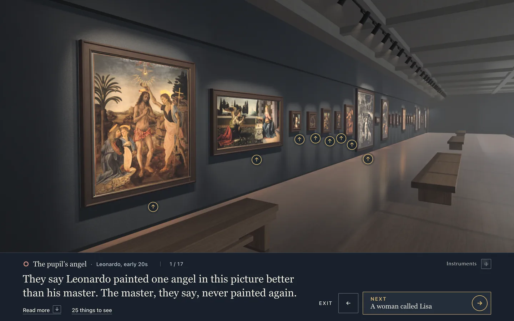 
  <em>The first stop. The paintings hang close to their real size, and a mark under each one opens it.</em>

## Three layers of text

A stop has a line you read first, a drawer with a few more lines, and a record that gives the grade and names the sources.

  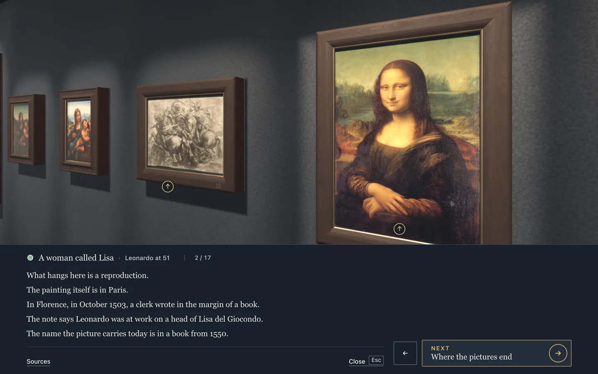 
  <em>The drawer at the Mona Lisa's stop.</em>

  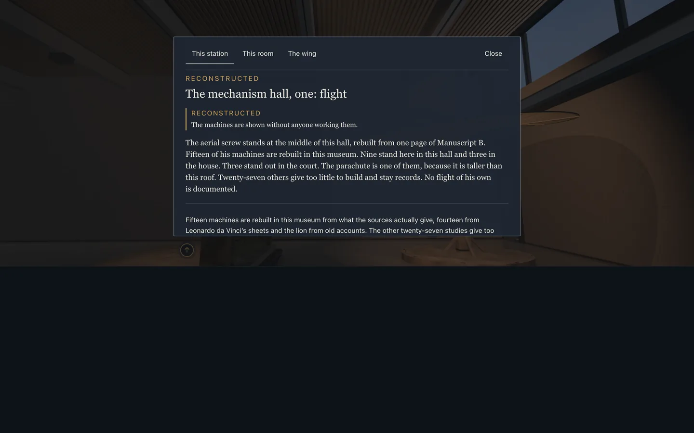 
  <em>The record at the aerial screw. Its grade is reconstructed, and it says that no flight of his is documented.</em>

## A close look

  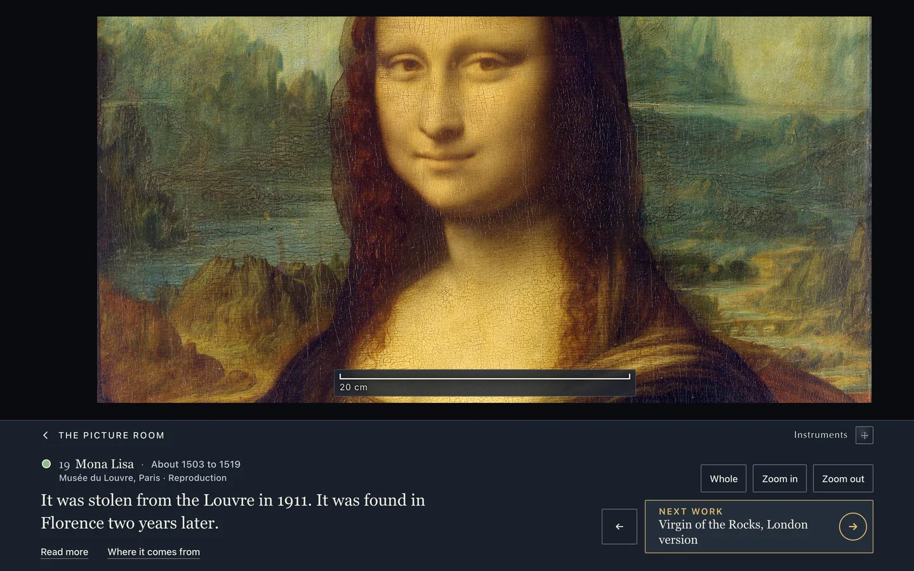 
  <em>Step up to a painting and zoom into the reproduction. The scale bar keeps its real size in view.</em>

## A machine in motion

  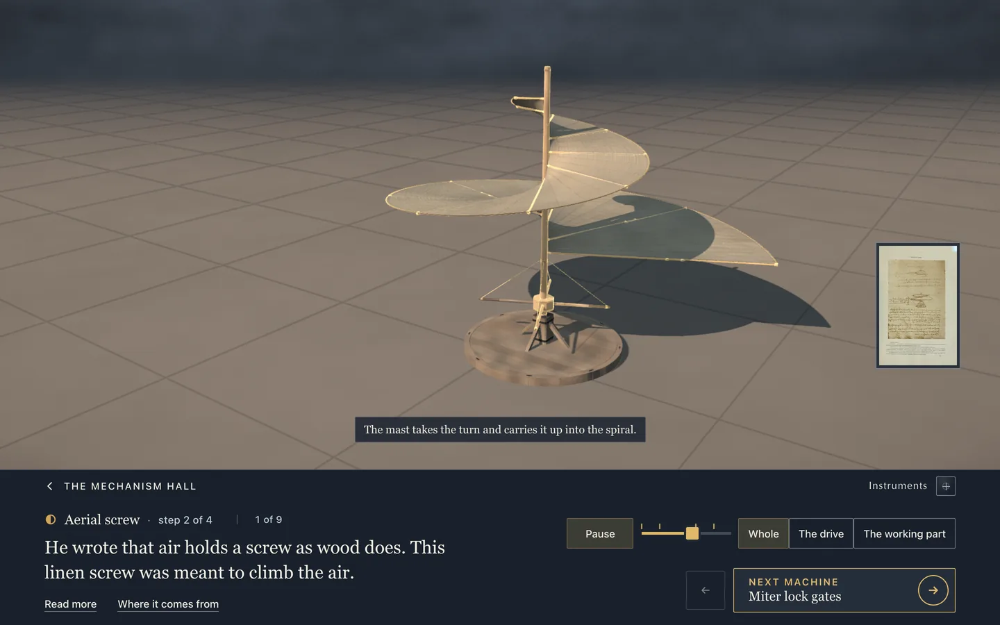 
  <em>The aerial screw, built in code after one page of Manuscript B, turning step by step. The page itself stands beside it in an 1883 facsimile.</em>

## The court of the Last Supper, in German

  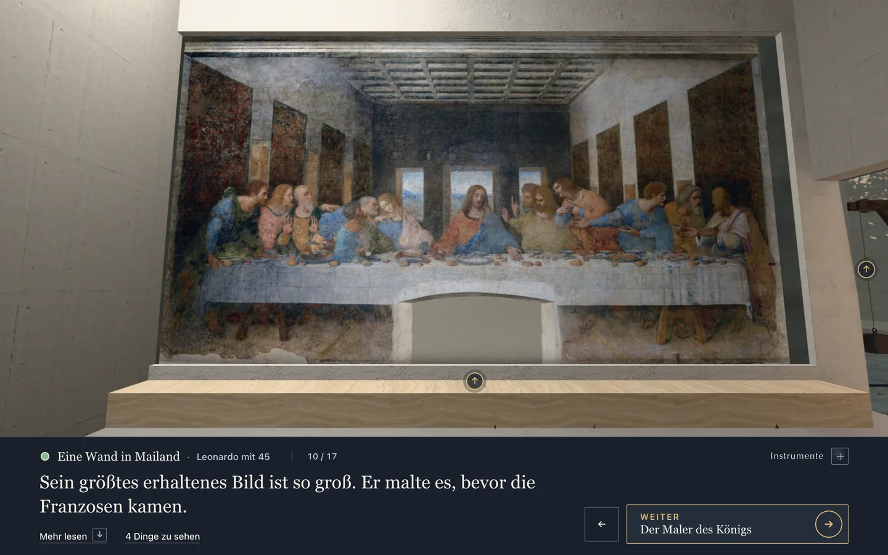 
  <em>The Last Supper at the size of the original in Milan. The court is the museum's own design, not a place from his life.</em>

## The house

  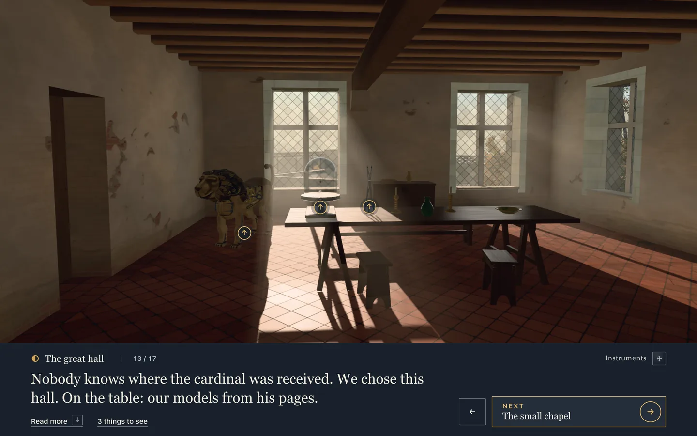 
  <em>The great hall of Clos Lucé. The diary of 1517 names no room for the cardinal's visit, and the stop says the museum chose this one.</em>

## The end of the walk

  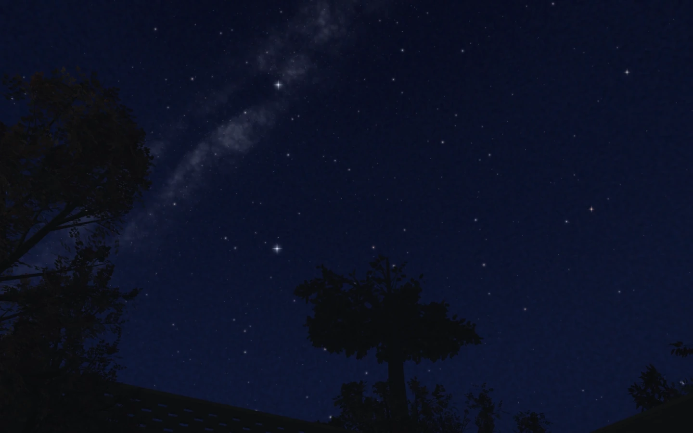 
  <em>The stars over Clos Lucé, worked out star by star from a catalogue for the day the diary gives and an hour the museum chose.</em>

## On a phone

  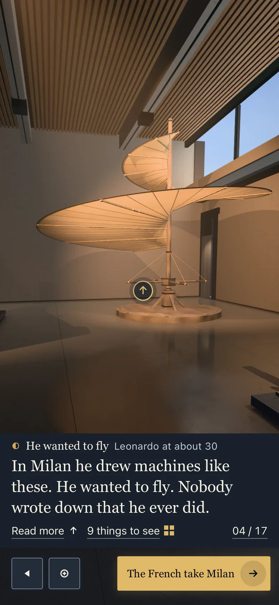
  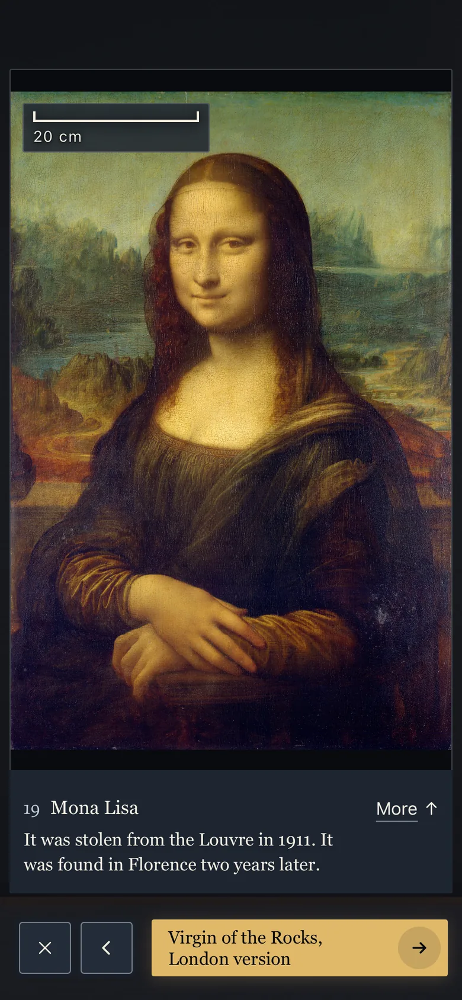 
  <em>The phone has a layout of its own: a stop in the mechanism hall, and a close look.</em>

## Credits

The pictures on this page and the moving picture in the README are the museum's own, under [CC BY-SA 4.0](https://creativecommons.org/licenses/by-sa/4.0/), © ChipMates gemeinnützige GmbH and contributors. The rooms, the machines, the house and the sky in them are built in code. The works of others inside them keep their own terms, as [CONTENT-LICENSE.md](../CONTENT-LICENSE.md) says. Here is each one, with its holder and its licence line as its record gives it. Where the label of a work held in Italy adds a note on the Italian heritage code, the note follows the line.

The note for those works reads: "Italian Codice dei beni culturali, art. 108 comma 3-bis: exemption for non-profit study, research and promotion of knowledge of the cultural heritage."

**The door, and the start of the moving picture.** Leonardo da Vinci, landscape of the Arno valley, 1473. Gallerie degli Uffizi, Florence, inv. 8 P. "Public domain. Photograph by Tangopaso, released into the public domain by the photographer (PD-self), via Wikimedia Commons." With the Italian note.

**The picture room, and the walk through it.** In view at the first stop:
- The Baptism of Christ. Gallerie degli Uffizi, Florence. "Public domain". With the Italian note.
- The Annunciation. Gallerie degli Uffizi, Florence. "Public domain". With the Italian note.
- Ginevra de' Benci, front and back. National Gallery of Art, Washington. "Public domain; Creative Commons Zero (CC0); Courtesy National Gallery of Art, Washington; https://www.nga.gov/terms-and-notices", and for the back, "Public domain; Creative Commons Zero (CC0); Courtesy National Gallery of Art, Washington, via Google Arts & Culture and Wikimedia Commons; https://artsandculture.google.com/asset/uAEHQEjvDfQp1Q"
- The Madonna of the Carnation. Bayerische Staatsgemäldesammlungen, Alte Pinakothek, Munich. "PD-Art | PD-old-100-expired"
- The Benois Madonna. State Hermitage Museum, Saint Petersburg. "Public domain"
- Saint Jerome. Pinacoteca Vaticana, Vatican City. "Creative Commons Zero, Public Domain Dedication"
- The Adoration of the Magi. Gallerie degli Uffizi, Florence. "Public domain"

Further along the same wall, small in these pictures:
- The Annunciation predella, the Virgin of the Rocks (Louvre version), La Belle Ferronnière, the Virgin and Child with Saint Anne, Saint John the Baptist, Bacchus: Musée du Louvre, Paris. "Public domain", except the Virgin and Child with Saint Anne and Saint John the Baptist: "Photo: Francesco Bini, CC BY-SA 4.0".
- Portrait of a Musician. Veneranda Biblioteca Ambrosiana, Milan. "Public domain". With the Italian note.
- Lady with an Ermine. Muzeum Narodowe w Krakowie, Muzeum Książąt Czartoryskich. "Public domain"
- The Madonna Litta. State Hermitage Museum, Saint Petersburg. "Public domain"
- The Burlington House Cartoon, and the Virgin of the Rocks (London version). National Gallery, London. "Public domain", and for the Virgin of the Rocks, "Photo: Sailko, CC BY 3.0".
- The Madonna of the Yarnwinder, two versions. Buccleuch collection, on loan to National Galleries of Scotland, and Kenneth C. Griffin Collection, on loan to The Metropolitan Museum of Art. "Public domain"
- A copy of the Battle of Anghiari. Musée du Louvre, Département des Arts graphiques, Paris. "Public domain"
- The Mona Lisa. Musée du Louvre, Paris. "Public domain"
- The Salvator Mundi. Private collection, present location unconfirmed. "Public domain"
- La Scapigliata. Galleria Nazionale di Parma, Complesso della Pilotta. "Public domain". With the Italian note.

**The Mona Lisa's stop and its close look, on the desktop and on the phone.** The Mona Lisa, the copy of the Battle of Anghiari and the two Madonnas of the Yarnwinder, as above. The close look's reproduction: Musée du Louvre, Paris. "Public domain"

**The aerial screw.** The facsimile page beside it: Manuscript B, Institut de France, Paris, in the facsimile by C. Ravaisson-Mollien, Paris 1883. "Public domain by age (published Paris, A. Quantin, 1883; editor Charles Ravaisson-Mollien d. 1919). Photolithographic facsimile of a public-domain manuscript: no new right under EU Directive 2019/790 art. 14 / UrhG s.68."

**The court of the Last Supper.** The Last Supper. Museo del Cenacolo Vinciano, Santa Maria delle Grazie, Milan. "Public domain". With the Italian note.

**The record, the great hall, the stars and the stop on a phone** show no work of others. The stars are computed from the Yale Bright Star Catalogue, credited in [THIRD-PARTY.md](../THIRD-PARTY.md). The house rests on map data © [OpenStreetMap contributors](https://www.openstreetmap.org/copyright), ODbL, and relief data from IGN, RGE ALTI®, consulted 8 September 2026, Licence Ouverte 2.0.
